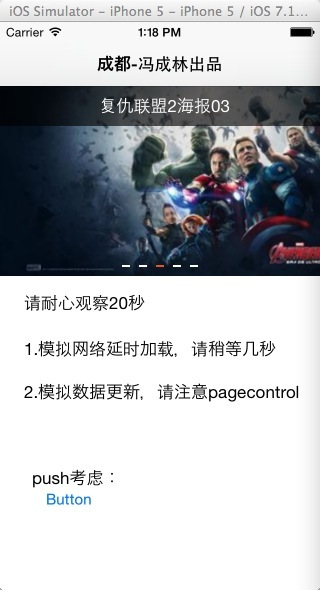

    Charlin出框架的目标：简单、易用、实用、高度封装、绝对解耦！

#### CorePPTVC
幻灯终结者：超简单、酷且炫、多样式、自定义、无限滚动！！ 

    注：本框架为了最大化的定制幻灯，并实现无限滚动。

#### 框架特性： 
>.1.支持ios7及以上系统. 
>.2.使用简单，传入数组即可. 
>.3.支持本地数组展示，网络数据展示，以及数组实时切换. 
>.4.支持子线程数据展示. 
>.5.界面使用Xib定制，方便您细微调整或者人性化定制. 
>.6.拥有良好的界面切换动画，多种样式可选择. 
>.7.支持定时器自动切换且界面push定时器停止. 
>.8.支持幻灯点击事件回调. 
>.9.幻灯框架可任意扩展与自定义. 
>.9.内部很多控件均可高度自定义样式，灵活性非常大. 

  

#### 使用示例
        //定义数据模型。如果数据来自远程服务器，可一键转模型，写法就没这么复杂了
        //我这里是模拟数据，写的有点多
        PPTModel *pptModel1 = [[PPTModel alloc] init];
        pptModel1.image = [UIImage imageNamed:@"1"];
        pptModel1.title =@"复仇联盟2海报01";
        
        PPTModel *pptModel2 = [[PPTModel alloc] init];
        pptModel2.image = [UIImage imageNamed:@"2"];
        pptModel2.title =@"复仇联盟2海报02";
    
        PPTModel *pptModel3 = [[PPTModel alloc] init];
        pptModel3.image = [UIImage imageNamed:@"3"];
        pptModel3.title =@"复仇联盟2海报03";
        
        PPTModel *pptModel4 = [[PPTModel alloc] init];
        pptModel4.image = [UIImage imageNamed:@"4"];
        pptModel4.title =@"复仇联盟2海报04";
        
        PPTModel *pptModel5 = [[PPTModel alloc] init];
        pptModel5.image = [UIImage imageNamed:@"5"];
        pptModel5.title =@"复仇联盟2海报05";
        
        
        NSArray *pptModels = @[pptModel1,pptModel2,pptModel3,pptModel4,pptModel5];
        
        
        CorePPTVC *pptvc = [[CorePPTVC alloc] init];
        
        //传递数据：模拟延时网络请求
        dispatch_after(dispatch_time(DISPATCH_TIME_NOW, (int64_t)(8.0f * NSEC_PER_SEC)), dispatch_get_main_queue(), ^{
            dispatch_async(dispatch_get_global_queue(DISPATCH_QUEUE_PRIORITY_DEFAULT, 0), ^{
                pptvc.pptModels = @[pptModel1,pptModel2,pptModel5];
            });
        });
        
        //模拟服务器数据更新
        dispatch_after(dispatch_time(DISPATCH_TIME_NOW, (int64_t)(16.0f * NSEC_PER_SEC)), dispatch_get_main_queue(), ^{
            pptvc.pptModels = pptModels;
        });
        
        //可使用autolayout
        pptvc.view.frame = CGRectMake(0, 64,320, 190);
        
        pptvc.pptItemClickBlock = ^(PPTModel *pptModel){
            NSLog(@"点击：%@",pptModel.title);
        };
        
        //重点，切记要加这句，不加后果非常严重
        [self addChildViewController:pptvc];
        [self.view addSubview:pptvc.view];

   
#### 重要说明  
1.如果自定义界面？ 
界面是xib做的，你想怎么弄都行。  
2.如何细微自定义？ 
请查阅并修改const文件。  
3.如果自定义pageControl？ 
pagecontrol是个自定义控件，请查阅：
高度自定义的pageControl 
https://github.com/nsdictionary/CorePageControl
  
4.觉得本框架还行？ 
请使劲的star、fork吧！5.1我都还在给大家做框架呢。是不是有点幸苦??哈哈  
    
    

  
    
#### 示例截图
  
  
  
  
  
  
  

  

-----
    CorePPTVC 幻灯终结者：超简单、酷且炫、多样式、自定义！！
-----

  

#### 版权说明 RIGHTS  
作品说明：本框架由iOS开发攻城狮Charlin制作。 
作品时间： 2015.05.01 18:07 
#### 关于Chariln INTRODUCE  
作者简介：Charlin-四川成都华西都市报旗下华西都市网络有限公司技术部iOS工程师！  

#### 联系方式 CONTACT  
Q    Q：1761904945（请注明缘由） 
Mail：1761904945@qq.com 
成都iOS开发群：163865401（Charlin创建与维护）
